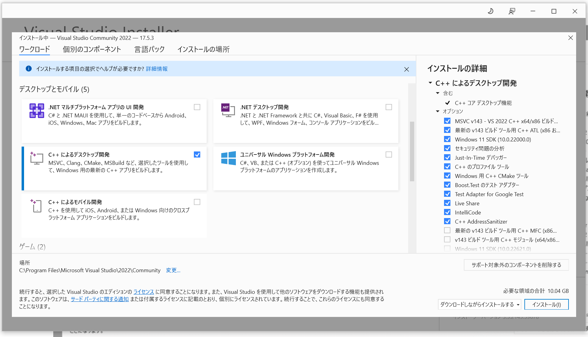
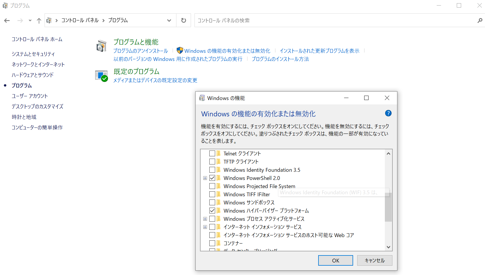
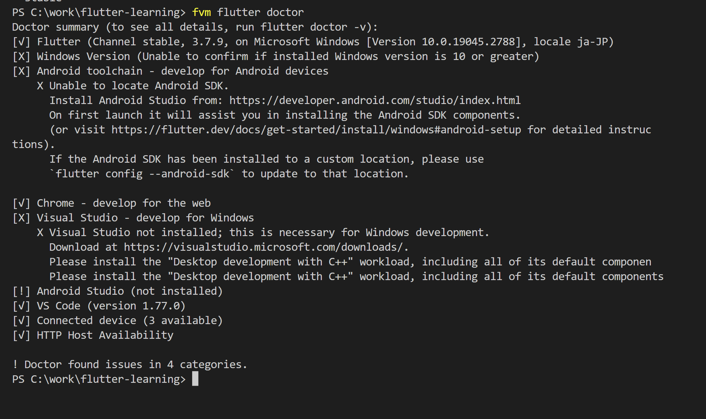

# Flutter 学習まとめ

- Flutterとは、スマホアプリ(iOS/Android)を作るためのフレームワーク。言語はDart。
- Flutterでアプリ開発をするためには、Flutter SDKというプログラムをインストールする必要がある。

## 環境構築

- プロジェクトごとにFlutter SDKのバージョンを管理したいので、そのままFlutter SDKをインストールはしない。
- FVM(Flutter Version Management)というアプリをインストールして、それを通してFlutter SDKをインストール・利用する。  
**※注意: fvmをインストールして使う場合、flutterコマンドは、「fvm flutter」コマンドに置き換わる。**  
**(例: `flutter --version`コマンドは使えず、`fvm flutter --version`とすることで使える。)**
- また、PC上でスマホアプリの動作確認を行うために、スマートフォンをPC上で起動するアプリ(エミュレータ)もインストールする。

### 環境構築 Windows編

- 全体の流れとしては、flutterと無関係のChocolateyというコマンドラインツールをインストールして、その機能を使いFVMをインストールする。
(FVMと、Flutter SDKにはDart SDKが必要なので一緒にインストールされる)

1. Chocolateyのインストール
  - [公式サイト](https://chocolatey.org/install#individual)の手順に沿って行う。
  - PowerShellを管理者権限で起動し、以下のコマンドを実行  
  `Set-ExecutionPolicy Bypass -Scope Process -Force; [System.Net.ServicePointManager]::SecurityProtocol = [System.Net.ServicePointManager]::SecurityProtocol -bor 3072; iex ((New-Object System.Net.WebClient).DownloadString('https://community.chocolatey.org/install.ps1'))`
2. FVMのインストール
  - PowerShellを管理者権限で起動し、以下のコマンドを実行  
  `choco install fvm`  
  (コマンド実行中に入力を何度か求められるので、全て「yes」と入力)
3. Visual Studio のインストール
  - Visual Studio の「C++デスクトップ開発のワークロード」なるものがFlutter SDKを動作させるのに必要らしいため、それをインストールする。
  - [Visual Studioの公式サイト](https://visualstudio.microsoft.com/ja/downloads/)からCommunity版のインストーラをダウンロードして起動する。
  - インストーラで、以下の写真のようなワークロードを選択する項目がでるので、「C++によるデスクトップ開発」のみを選択してインストール。  
  
  - PCを再起動する。
4. Android Studioのインストール
  - [公式サイト](https://developer.android.com/studio)からインストールする。基本的にはオプションをいじらなくてOK。
  - 「Android Studio SDK Components setup」の最後のインストール画面で、最後の方に以下のようなエラーが出た場合、  
  `Intel® HAXM installation failed. To install Intel® HAXM follow the instructions found at: https://github.com/intel/haxm/wiki/Installation-Instructions-on-Windows`  
  WHPXを有効化する必要がある（[参考記事](https://qiita.com/rice_rice_rice/items/c00f1338b173a149fb28)）。
    - 以下の画像のように、「コントロールパネル > プログラム > Windowsの機能の有効可または無効可」という項目を押下し、「Windows ハイパーバイザー プラットフォーム」の項目にチェックを入れてOKを押下する。  
    
    - PCを再起動する。
5. Android Studioにcmdline-tools componentをインストール（[参考記事](https://zenn.dev/imasaka0909/articles/00ebfaf74f9cea)）
  - Android Studioを起動し、「More Actions」からSDK Managerを起動する。
  - 左のタブ「Appearance&Behavior > System Settings > Android SDK」を押下して、中央上部の「SDK Tools」タブを選択すると、「Android SDK Command-line Tools(latest)」があるので、それにチェックを入れ「Apply」を選択する。
6. Androidのライセンスを許諾する。
  - 以下のコマンドを実行  
  `fvm flutter doctor --android-licenses`
  - すると、対話型のシェルになるので、全部「y」を押してライセンスを承認すればOK


### 環境構築 Mac編

1. FVMのインストール
  - 以下のコマンドを実行する。homebrewが未インストールであればインストールしてから行う。  
  `brew tap leoafarias/fvm`  
  `brew install fvm`  
2. Xcodeのインストール
  - iOSエミュレータなどが入っている「Xcode」というアプリをAppStoreからインストールする。
  - 以下のコマンドを実行する。エミュレータのライセンス等に関する許諾をするコマンド。  
  `sudo xcode-select --switch /Applications/Xcode.app/Contents/Developer`  
  `sudo xcodebuild -runFirstLaunch`  
3. cocoapodsのインストール
  - 以下のコマンドを実行する。cocoapodsは、iOSアプリ開発のライブラリ管理ツールとのこと。([参考記事](https://tech-begin.com/programming-coding/ios/about-cocoapods/))  
  `brew install cocoapods`

### 診断コマンド flutter doctor

- flutter SDKは開発環境に必要なツールが多いため、開発環境の条件が満たせているかどうかを診断するコマンドがある。それが`flutter doctor`コマンドだ。
- `fvm flutter doctor`と実行すると、名前の通り診断結果が表示される。その中に`[X]`があったりするとうまく動かないので、解決する必要がある。
- こんな感じ。
---


---

### エミュレータを作ろう！の巻

[公式ドキュメント](https://developer.android.com/studio/run/managing-avds?hl=ja)

これからモバイルアプリの開発環境を作るのだが、動作確認をするために実際のモバイル端末を用意して、開発途中のアプリを移して...とやるのは効率が悪い。  
そこで、PC上で仮想のモバイル端末を動作させて、サクサク動作確認を行えるようにする。こうしたPC上の仮想のモバイル端末を動かすためのアプリをエミュレータという。  
また、モバイル端末と一口に言ってもOSやハードの種類は様々なため、何かしらのモバイル端末のプリセットを作成しておく必要がある。  
そこで、Android StudioのAndroid Virtual Device(AVD)を利用する。

#### 手順

- Android Studio を起動して、「More Actions > Virtual Device Manager」 を起動する。
- Create device を押下する。
- ハードウェア選択画面になるので、お好みで選択
- System Image選択画面になるので、お好みで選択  
(知らない要素がいっぱい出てきたので項目ごとに調べてみた)
  - APIレベルとは？([参考記事](https://ekulabo.com/unity-android-api-level))
    - AndroidOSが提供するAPIの管理番号のこと。バージョンアップのたびに1増える。なので、アプリ開発者側は「自分のアプリはAPIレベルが最小10から最大28までサポートしてますよ～」みたいな感じで宣言するために使う、らしい。
  - ABIとは？([参考記事](https://backport.net/blog/2017/06/23/android_abi/#:~:text=ABI%20%E3%81%AF%E3%80%81%E3%82%A2%E3%83%97%E3%83%AA%E3%82%B1%E3%83%BC%E3%82%B7%E3%83%A7%E3%83%B3%E3%81%AE%E3%83%9E%E3%82%B7%E3%83%B3,%E6%8C%87%E5%AE%9A%E3%81%99%E3%82%8B%E5%BF%85%E8%A6%81%E3%81%8C%E3%81%82%E3%82%8A%E3%81%BE%E3%81%99%E3%80%82))
    - とりあえず、C++みたいな低級言語でないと意識する必要はないとのこと。

### 環境構築 VSCode - プロジェクト作成

- FVMをインストールしても、すぐにflutterコマンドが使えるようにはならない。flutterのバージョンを指定する必要がある。  
flutterのバージョンはプロジェクトごとに管理するため、まずはプロジェクトを作ろう。

- 空のフォルダを作ったら、そのフォルダをワークスペースとして開く。そのフォルダに、`.vscode`というディレクトリを作成し、`settings.json`を作成する。ファイルの内容は、このプロジェクトの`settings.json`をそのままコピペすればよし。

- プロジェクトがgitのリポジトリであるなら、トップレベルに`.gitignore`ファイルを作成する。内容はコピペする。

- 使用するFlutter SDKのバージョンを指定する。普通は、最新の安定板(Stable)を選択すればよい。
  - `fvm releases`コマンドを実行し、最新のリリース情報を取得する。最後の方に、stableと出てるバージョンが出るので、それを指定する。
  - すでにfvmを使わずFlutter SDKのプロジェクトを作成していた場合、`fvm use <バージョン名>`とすることで、このプロジェクト内で使うFlutter SDKのバージョンを指定できる。  
  例: `fvm use 3.7.9`とすれば、バージョン3.7.9のFlutter SDKがこのプロジェクト用に設定される。
  - もしくは、`fvm use stable`としても良い。この場合、最新の安定版がプロジェクトに設定される。

  - 完全に新規のプロジェクトである場合は、末尾に`-- force`とつける。  
  例: `fvm use stable --force` (安定版を設定する方法)

    - 指定したバージョンのFlutter SDKが端末に一度もインストールされていない場合、以下のようなメッセージが出るが、「Y」を押下する。  
    ```
    Flutter "stable" is not installed.
    Would you like to install it? Y/n:
    ```

  - ちなみに、オプションで`global`をつければ、プロジェクト外のディレクトリでも指定したバージョンでflutterコマンドが使えるようになるが、各プロジェクト外で使うシーンがないためあまり意味はない(`fvm use global 3.7.9`)。

  - `fvm flutter create <アプリ名>`で、プロジェクトのひな形を作成できる。
